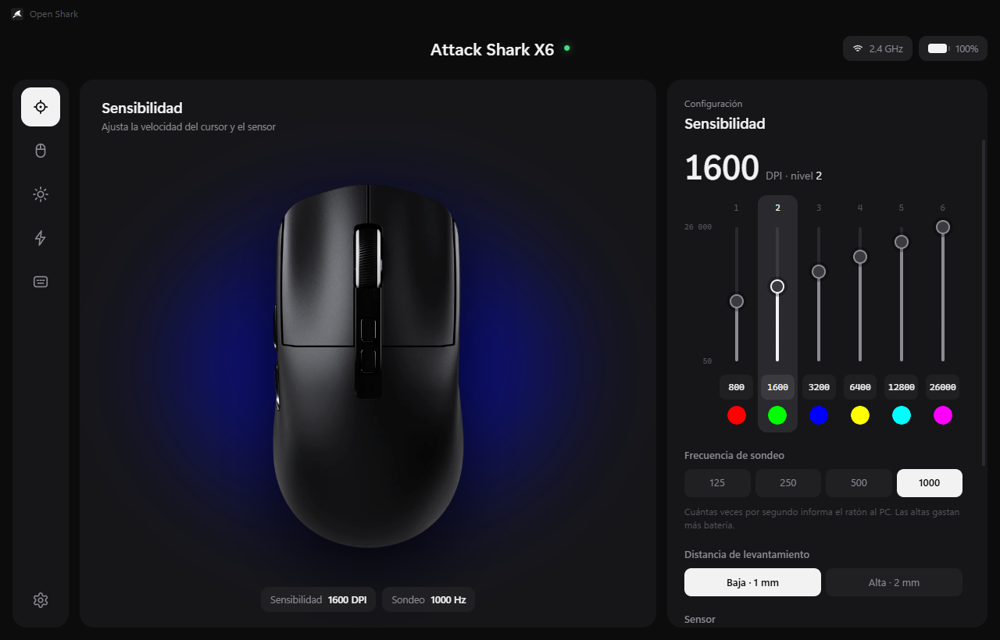
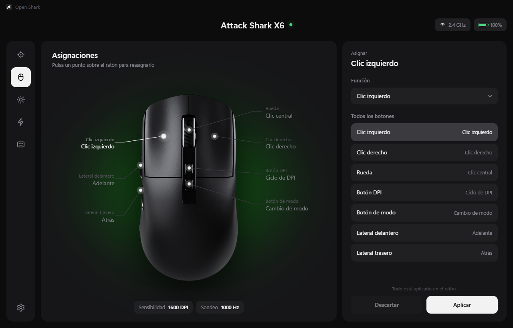
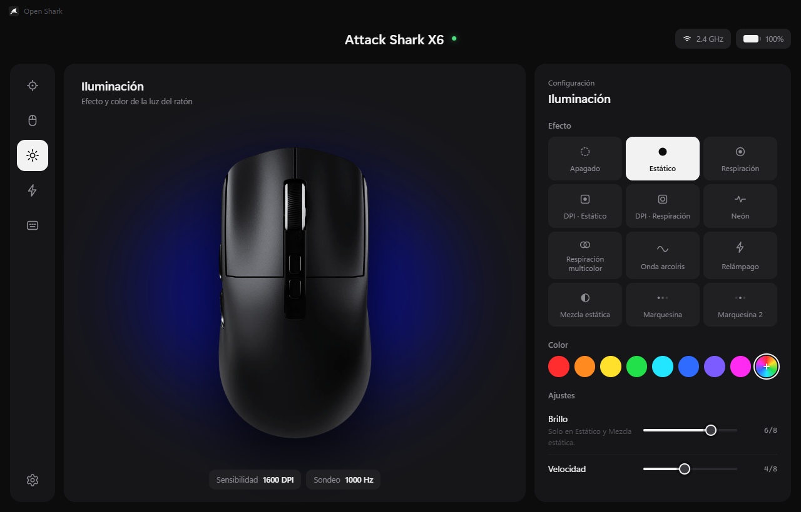
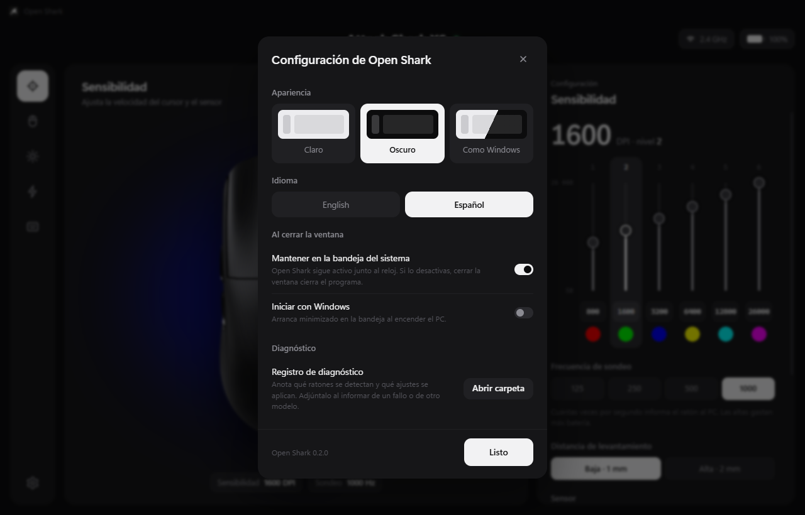

<br>
<br>
<h1 align="center">
  <picture>
    <source media="(prefers-color-scheme: dark)" srcset="docs/logo/open-shark-blanco.png">
    
  </picture>
  <br>
  <br><br>
</h1>

<p align="center"><a href="README.md">English</a> · <b>Español</b></p>

Configurador abierto para ratones **Attack Shark**: una interfaz más clara que la
oficial y pensada para quien tiene varios ratones de la marca. Cada ratón
conectado muestra su conexión y su batería, y guarda su propia configuración.



> **Probado solo con el Attack Shark X6** (receptor 2.4 GHz y cable).
> Otros modelos de la marca pueden funcionar, total o parcialmente, si usan el
> mismo protocolo. Si tienes otro, pruébalo y cuéntame qué funciona y qué no:
> mira [Probar con otro modelo](#probar-con-otro-modelo).

El protocolo se obtuvo por ingeniería inversa del software oficial; está
documentado en [docs/PROTOCOL.md](docs/PROTOCOL.md).

| Asignaciones | Iluminación | Configuración |
|---|---|---|
|  |  |  |

## Qué puedes configurar

- **Sensibilidad**: hasta 8 niveles de DPI (50–26 000) con su color, frecuencia
  de sondeo (125–1000 Hz), distancia de levantamiento, Motion Sync, corrección
  de ondulación, ajuste de ángulo y antirrebote.
- **Botones**: cualquier función de ratón, DPI, multimedia, navegador, atajos
  predefinidos, combinaciones de teclas propias o macros.
- **Iluminación**: 12 efectos, color, brillo y velocidad.
- **Energía**: apagado de luces y reposo profundo.
- **Macros**: grabación desde el teclado con las esperas reales.
- **Batería**: nivel y estado de carga en la barra superior (cargando o carga
  completa), con animación mientras carga por cable.

La primera vez que conectas un ratón, Open Shark importa los perfiles del
software original si está instalado.

## Descarga (versión portable)

1. Descarga `OpenShark-<versión>-portable-win-x64.zip` desde la sección
   **Releases** del repositorio.
2. Descomprímelo en una carpeta fija, por ejemplo `C:\Programas\Open Shark`.
3. Abre `Open Shark.exe`.

No necesita instalación. Para actualizar, reemplaza la carpeta por la de la
nueva versión; tus perfiles se guardan aparte, en `%APPDATA%\Open Shark`.

Como el ejecutable no está firmado, Windows puede mostrar "Windows protegió su
PC": pulsa **Más información → Ejecutar de todas formas**.

Si activas "Iniciar con Windows" y luego mueves la carpeta, vuelve a activarlo.

## Uso

Al cerrar la ventana, Open Shark sigue activo en la bandeja del sistema (junto
al reloj). Clic en el icono para abrirlo; clic derecho para "Iniciar con
Windows" o "Salir".

El engranaje abajo a la izquierda abre la configuración del programa:

- **Apariencia**: tema claro, oscuro o como Windows.
- **Idioma**: inglés o español. La primera vez se usa el idioma de Windows
  (español si Windows está en español; inglés en cualquier otro caso).
- **Al cerrar la ventana**: mantener en la bandeja e iniciar con Windows.
- **Diagnóstico**: abre la carpeta del registro.

Los botones **Aplicar** y **Descartar** solo aparecen cuando hay cambios sin
enviar al ratón.

## Probar con otro modelo

Open Shark guarda un registro de diagnóstico con lo que detecta y lo que envía:
los ratones y receptores conectados (VID/PID y colecciones HID), cada ajuste que
se aplica con su resultado (`OK`, `sin ACK`, `FALLÓ`), los cambios de batería y
los errores.

1. Conecta tu ratón y abre Open Shark. Si no aparece, el registro ya habrá
   anotado su VID/PID igualmente.
2. Si aparece, prueba cada sección y pulsa **Aplicar**. Fíjate en qué cambia de
   verdad en el ratón (DPI, luz, botones…).
3. En el engranaje de abajo a la izquierda, pulsa **Diagnóstico → Abrir
   carpeta** y copia `open-shark.log`.
4. Abre un [*issue*](../../issues/new/choose) con la plantilla "Support for
   another mouse", adjunta el registro y cuenta qué funcionó y qué no. Puedes
   escribirlo en español.

El registro no guarda datos personales ni números de serie. Está en
`%APPDATA%\Open Shark\logs`.

## Desarrollo

Requisitos: Windows 10/11 y Node.js 20 o superior.

```bash
npm install
```

```bash
npm start
```

También puedes hacer doble clic en `Abrir Open Shark.cmd`.

Si tras `npm install` falta `node_modules\electron\dist\electron.exe` (con
Node 24 el descompresor de Electron puede terminar sin hacer nada), extráelo a
mano desde la caché que ya descargó npm:

```powershell
$z = (Get-ChildItem "$env:LOCALAPPDATA\electron\Cache" -Recurse -Filter "electron-v*-win32-x64.zip" | Sort-Object LastWriteTime | Select-Object -Last 1).FullName; Expand-Archive $z node_modules\electron\dist -Force; Set-Content node_modules\electron\path.txt "electron.exe" -NoNewline
```

Otros comandos:

```bash
npm test
```

```bash
npm run probe
```

```bash
npm run dist
```

`dist` genera el .zip portable en `dist/`. Antes de publicar una versión, sube
el número en `version` de `package.json`.

`probe` lista los ratones detectados y muestra sus eventos (batería, nivel DPI)
durante 5 segundos. `npm run probe -- polling 3` envía solo la frecuencia de
sondeo, útil para comprobar que la comunicación funciona.

Puedes dejar abierto el software original: ambos pueden convivir, pero el último
que aplique cambios es el que manda.

### Traducciones

Todos los textos de la interfaz están en `src/renderer/i18n.js` (inglés y
español); los del menú de la bandeja, en `src/main/main.js`. Para añadir un
idioma, copia el bloque `en`, tradúcelo y añádelo a `DICTS` y `LANGUAGES`. Si
falta una clave en un idioma, se muestra la inglesa.

## Estructura

```
src/core/protocol/x6.js    Codificación de paquetes (funciones puras, con tests)
src/core/models.js         Modelos soportados: VID/PID, colecciones y botones físicos
src/core/device-manager.js Detección de varios ratones, eventos y envío con ACK
src/core/oem-import.js     Lectura del pro.data del software oficial
src/core/store.js          Perfiles por ratón y preferencias (userData/open-shark.json)
src/core/logger.js         Registro de diagnóstico
src/main/                  Proceso principal de Electron y puente IPC
src/renderer/              Interfaz (i18n.js: textos en inglés y español)
tools/probe.js             Diagnóstico por consola
```

## Añadir otro ratón Attack Shark

1. Conéctalo y ejecuta `npm run probe` (o mira el VID/PID en el Administrador de
   dispositivos).
2. Si su software oficial es de la misma familia (misma estructura de
   `Mouse.exe`, `hiddriver_1.dll`), lo normal es que hable el mismo protocolo:
   añade sus PID a `src/core/models.js` y define sus botones físicos (con su
   `id` y su nombre en `src/renderer/i18n.js`, claves `btn.<id>`).
3. Si no, crea `src/core/protocol/<modelo>.js` con la misma interfaz que `x6.js`.

## Notas conocidas

- El firmware no permite leer la configuración del ratón: lo que ves es lo que
  Open Shark guardó o importó.
- La batería se informa en tramos de 10 %. La carga solo se ve con el cable
  conectado, porque entonces el ratón deja de usar el receptor.
- El byte de LOD del paquete DPI difiere de la app original (ver
  docs/PROTOCOL.md). Si el LOD no cambia nada, pon `LOD_AT_BYTE3 = false`.
- Las macros solo graban teclado (no clics de ratón).
