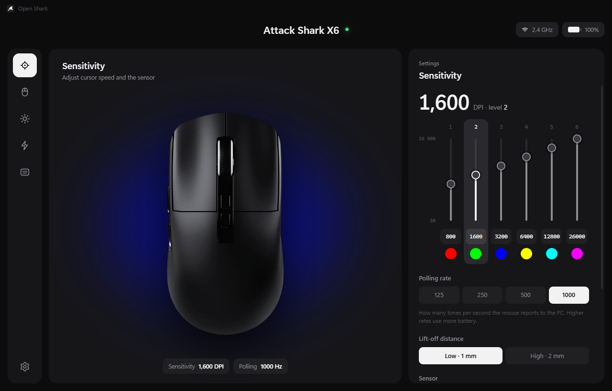
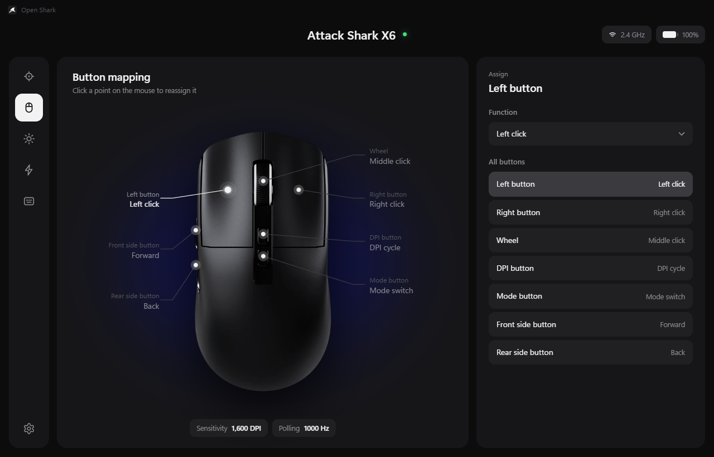
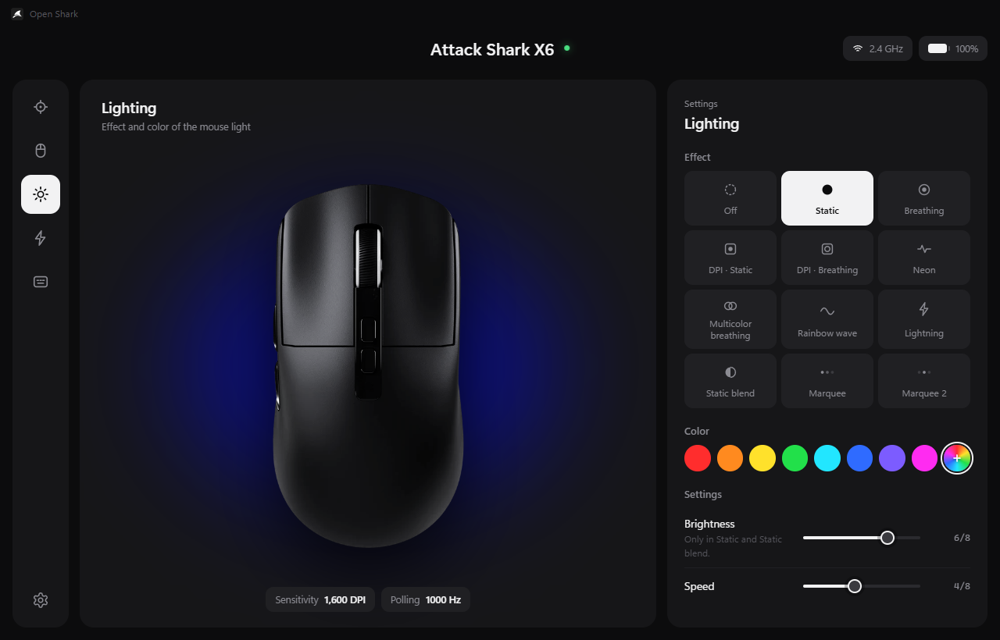
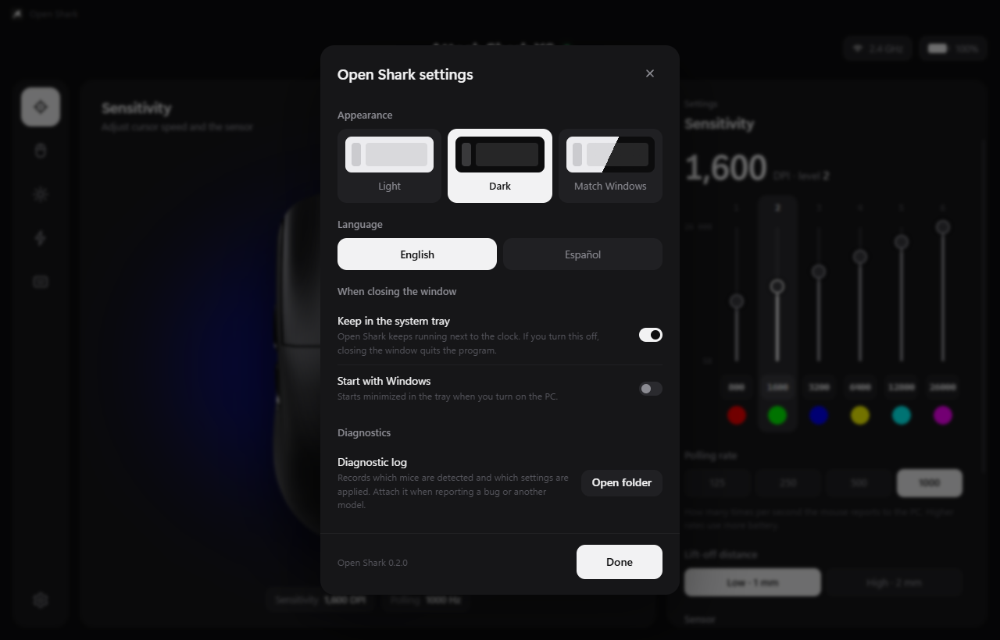

<br>
<br>
<h1 align="center">
  <picture>
    <source media="(prefers-color-scheme: dark)" srcset="docs/logo/open-shark-blanco.png">
    
  </picture>
  <br>
  <br><br>
</h1>

<p align="center"><b>English</b> · <a href="README.es.md">Español</a></p>

An open configurator for **Attack Shark** mice: a clearer interface than the
official one, built for people who own more than one mouse from the brand.
Each connected mouse shows its connection and battery, and keeps its own
settings.



> **Only tested with the Attack Shark X6** (2.4 GHz receiver and cable).
> Other models from the brand may work, fully or partly, if they use the same
> protocol. If you have another one, try it and tell me what works and what
> doesn't: see [Testing another model](#testing-another-model).

The protocol was reverse-engineered from the official software; it is
documented (in Spanish) in [docs/PROTOCOL.md](docs/PROTOCOL.md).

| Button mapping | Lighting | Settings |
|---|---|---|
|  |  |  |

## What you can configure

- **Sensitivity**: up to 8 DPI levels (50–26,000) with their colors, polling
  rate (125–1000 Hz), lift-off distance, Motion Sync, ripple control, angle
  snapping and debounce.
- **Buttons**: any mouse function, DPI, media, browser, built-in shortcuts,
  your own key combinations or macros.
- **Lighting**: 12 effects, color, brightness and speed.
- **Power**: light-off timer and deep sleep.
- **Macros**: recorded from the keyboard with the real delays.
- **Battery**: level and charging state in the top bar (charging or fully
  charged), animated while charging over the cable.

The first time you connect a mouse, Open Shark imports the profiles from the
original software if it is installed.

## Download (portable version)

1. Download `OpenShark-<version>-portable-win-x64.zip` from the repository's
   **Releases** section.
2. Extract it to a permanent folder, for example `C:\Programs\Open Shark`.
3. Open `Open Shark.exe`.

No installation needed. To update, replace the folder with the new version;
your profiles are stored separately in `%APPDATA%\Open Shark`.

Because the executable isn't signed, Windows may show "Windows protected your
PC": click **More info → Run anyway**.

If you turn on "Start with Windows" and later move the folder, turn it on again.

## Usage

When you close the window, Open Shark keeps running in the system tray (next to
the clock). Click the icon to open it; right-click for "Start with Windows" or
"Quit".

The gear at the bottom left opens the program settings:

- **Appearance**: light, dark or match Windows.
- **Language**: English or Spanish. On first launch it follows Windows (Spanish
  if Windows is in Spanish, English otherwise).
- **When closing the window**: keep in the tray and start with Windows.
- **Diagnostics**: opens the log folder.

The **Apply** and **Discard** buttons only appear when there are changes not
yet sent to the mouse.

## Testing another model

Open Shark keeps a diagnostic log of what it detects and what it sends: the
connected mice and receivers (VID/PID and HID collections), every setting
applied with its result (`OK`, `sin ACK`, `FALLÓ`), battery changes and errors.

1. Connect your mouse and open Open Shark. Even if it doesn't show up, the log
   will have recorded its VID/PID.
2. If it shows up, try each section and click **Apply**. Note what actually
   changes on the mouse (DPI, lighting, buttons…).
3. Click the gear at the bottom left, then **Diagnostics → Open folder**, and
   copy `open-shark.log`.
4. Open an [issue](../../issues/new/choose) with the "Support for another
   mouse" template, attach the log and describe what worked and what didn't.

The log contains no personal data or serial numbers. It lives in
`%APPDATA%\Open Shark\logs`. Its messages are in Spanish; the data in it (IDs,
bytes, results) is what matters.

## Development

Requirements: Windows 10/11 and Node.js 20 or later.

```bash
npm install
```

```bash
npm start
```

You can also double-click `Abrir Open Shark.cmd`.

If `node_modules\electron\dist\electron.exe` is missing after `npm install`
(with Node 24 the Electron extractor may finish without doing anything),
extract it by hand from the cache npm already downloaded:

```powershell
$z = (Get-ChildItem "$env:LOCALAPPDATA\electron\Cache" -Recurse -Filter "electron-v*-win32-x64.zip" | Sort-Object LastWriteTime | Select-Object -Last 1).FullName; Expand-Archive $z node_modules\electron\dist -Force; Set-Content node_modules\electron\path.txt "electron.exe" -NoNewline
```

Other commands:

```bash
npm test
```

```bash
npm run probe
```

```bash
npm run dist
```

`dist` builds the portable .zip in `dist/`. Before publishing a release, bump
`version` in `package.json`.

`probe` lists the detected mice and prints their events (battery, DPI level)
for 5 seconds. `npm run probe -- polling 3` sends only the polling rate, which
is handy to check that communication works.

You can keep the official software open: both can coexist, but whichever
applies changes last wins.

### Translations

All interface texts live in `src/renderer/i18n.js` (English and Spanish); the
tray menu texts are in `src/main/main.js`. To add a language, copy the `en`
block, translate it and add it to `DICTS` and `LANGUAGES`. Missing keys fall
back to English.

## Project structure

```
src/core/protocol/x6.js    Packet encoding (pure functions, with tests)
src/core/models.js         Supported models: VID/PID, collections and physical buttons
src/core/device-manager.js Multi-mouse detection, events and sending with ACK
src/core/oem-import.js     Reads pro.data from the official software
src/core/store.js          Per-mouse profiles and preferences (userData/open-shark.json)
src/core/logger.js         Diagnostic log
src/main/                  Electron main process and IPC bridge
src/renderer/              Interface (i18n.js: English and Spanish texts)
tools/probe.js             Command-line diagnostics
```

## Adding another Attack Shark mouse

1. Connect it and run `npm run probe` (or look up its VID/PID in Device
   Manager).
2. If its official software is from the same family (same `Mouse.exe`,
   `hiddriver_1.dll` layout), it most likely speaks the same protocol: add its
   PIDs to `src/core/models.js` and define its physical buttons (with an `id`
   and its names in `src/renderer/i18n.js`, keys `btn.<id>`).
3. Otherwise, create `src/core/protocol/<model>.js` with the same interface as
   `x6.js`.

## Known limitations

- The firmware doesn't allow reading the mouse's settings: what you see is what
  Open Shark saved or imported.
- Battery is reported in 10 % steps. Charging is only visible with the cable
  plugged in, because the mouse then stops using the receiver.
- The LOD byte of the DPI packet differs from the original app (see
  docs/PROTOCOL.md). If LOD changes nothing, set `LOD_AT_BYTE3 = false`.
- Macros only record the keyboard (not mouse clicks).
